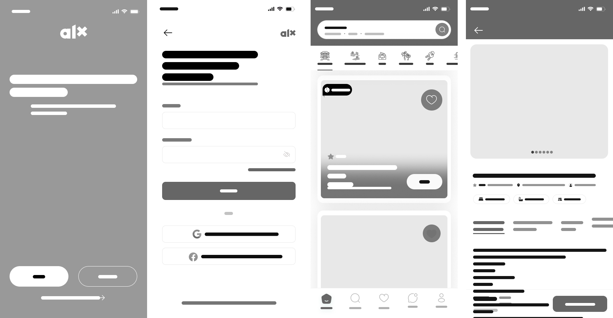
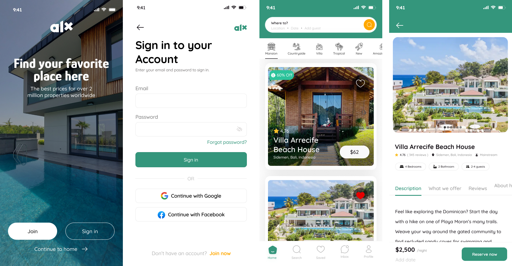

# Wireframing

## Introduction

Wireframing is a fundamental step in the UI/UX design process that focuses on creating the skeletal structure of a user interface. It serves as a blueprint, guiding the design and development of a product. Wireframes help designers and stakeholders visualize the layout, navigation, and functionality of a product before any actual coding begins. By addressing usability challenges early, wireframing reduces risks and ensures a smoother development process.

---

## Key Elements of Wireframes

Wireframes consist of several core elements that contribute to an effective design:

### 1. **Layout Structure**
   - Defines the overall arrangement of content and components on the interface.
   - **Example**: Aligning a hero section at the top, followed by a grid layout for featured listings.

### 2. **Navigation**
   - Outlines how users move between different pages or sections of the product.
   - **Example**: Including a top navigation bar with links to "Home," "About Us," and "Contact Us."

### 3. **Content Placement**
   - Indicates where text, images, and other media will be displayed.
   - **Example**: Placing a description below a property image in a listing.

### 4. **Functionality**
   - Highlights interactive elements like buttons, forms, and dropdown menus.
   - **Example**: A "Reserve Now" button for booking a property.

---

## Types of Wireframes

Wireframes can be categorized into two types:

### 1. **Low-Fidelity Wireframes**
   - Simplistic and focused on the basic structure and layout.
   - Typically used in the early stages of design to communicate initial ideas.
   - **Use Case**: Sketching the layout of a homepage with placeholders for images and text.

### 2. **High-Fidelity Wireframes**
   - More detailed and includes design elements like colors, fonts, and interactivity.
   - Used later in the design process to provide a realistic preview of the final product.
   - **Use Case**: A complete design of a booking page with interactive buttons and a detailed property description.

**Screens Attached**: The provided screens represent **High-Fidelity Wireframes**, as they include detailed visuals, typography, and functionality.

**Low-Fidelity Wireframes**:

**High-Fidelity Wireframes**:

---

## Popular Wireframing Tools

### **Figma**
Figma is a powerful wireframing tool that offers collaborative features, making it ideal for teams working on UI/UX projects. Its features include:
- **Real-Time Collaboration**: Allows multiple designers to work on a project simultaneously.
- **Component Libraries**: Reusable design elements for consistency.
- **Cross-Platform**: Accessible on any device with an internet connection.

Other tools include Adobe XD, Sketch, and Balsamiq.

---

## Benefits of Wireframing in Software Development

Wireframing offers several advantages in the software development process:

1. **Guides the Design Process**
   - Provides a clear structure for designers and developers to follow.
   - Reduces ambiguity and aligns the team on the product’s vision.

2. **Facilitates Communication**
   - Acts as a visual aid during discussions with stakeholders.
   - Helps non-technical team members understand the design approach.

3. **Identifies Usability Challenges Early**
   - Allows potential issues to be addressed before development begins.
   - Saves time and resources by reducing the need for revisions.

---

## Real-World Scenario: Broaden Energy Project

In a previous project with **Broaden Energy**, wireframing played a critical role in designing their website. The project included elements such as:

- **Logo/Branding**: Positioned prominently on the homepage.
- **Navigation Menu**: Streamlined navigation for easy access to sections.
- **Hero Image/Video**: Created a strong first impression with engaging visuals.
- **Services Overview**: Displayed the company’s offerings clearly.
- **Testimonials/Reviews**: Built trust with real user feedback.
- **Contact Information**: Made it easy for users to get in touch.
- **Call to Action (CTA)**: Encouraged users to take specific actions like booking a consultation.
- **Footer**: Provided essential links and information.
- **FAQs and About Us**: Addressed common questions and introduced the company.
- **Social Media Links and Search Bar**: Enhanced discoverability and connectivity.

### Impact of Wireframing:
- **Identified Potential Usability Issues**: The navigation menu was restructured to improve user flow.
- **Improved Communication**: Stakeholders could visualize the layout and provide valuable feedback.
- **Result**: The final product was user-friendly, visually appealing, and aligned with the company’s goals.

---

## Conclusion

Wireframing is a cornerstone of the design process, bridging the gap between ideas and implementation. By identifying potential issues early and fostering collaboration, wireframes ensure the development of user-friendly, functional products. Whether it's a simple sketch or a high-fidelity design, wireframing sets the stage for success in software development.
